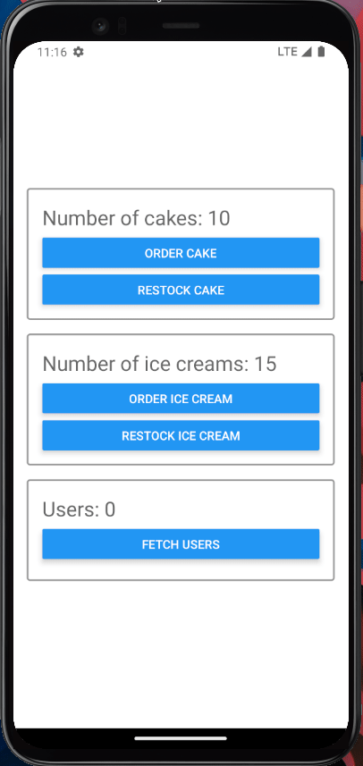

# React-Native-Redux

<h2 align="center">
  A simple redux managed app. Built with React Native, Expo and Redux.
</h2>

<p align="center">
  
  
  
  
  <a href="https://github.com/areasflavio/react_native_redux/commits/master">
    
  </a>
</p>

<p align="center">
  <a href="#star-features">Features</a>&nbsp;&nbsp;|&nbsp;&nbsp;
  <a href="#keyboard-technologies">Technologies</a>&nbsp;&nbsp;|&nbsp;&nbsp;
  <a href="#computer_mouse-installation">Installation</a>
</p>

<p align="center">
  
</p>

<br/>

# :star: Features

[(Back to top)](#React-Native-Redux)

Some key features are:

- State management with Redux and Redux Toolkit
- Dev environment state changes log with Redux Logger

The application is built using React Native with Expo framework.
The entire codebase is written using Typescript.

<br/>

# :keyboard: Technologies

[(Back to top)](#React-Native-Redux)

This is what I used and learned with this project:

- [x] React Native
- [x] Expo
- [x] Redux
- [x] Redux Toolkit
- [x] Redux Logger
- [x] Typescript

<br/>

# :computer_mouse: Installation

[(Back to top)](#React-Native-Redux)

To use this project, first you need NodeJS installed in your device,
then you can follow the commands below:

```bash
# Clone this repository
git clone https://github.com/areasflavio/react_native_redux.git

# Go into the repository
cd react_native_redux

# Install dependencies for the application
yarn install

# To start the development server, run the following command
yarn start

# You start the emulator following the terminal instructions or:
yarn start android # for android emulator

yarn start ios # for ios emulator
```

# :man_technologist: Author

[(Back to top)](#React-Native-Redux)

Build by Flávio Arêas 👋 [Get in touch!](https://www.linkedin.com/in/areasflavio/)
